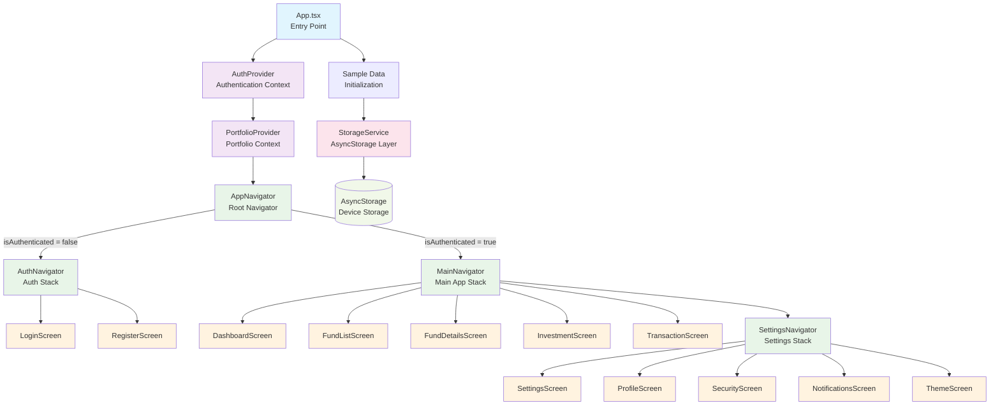
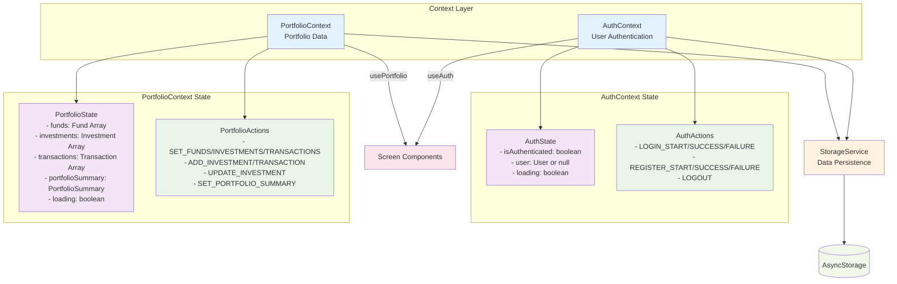
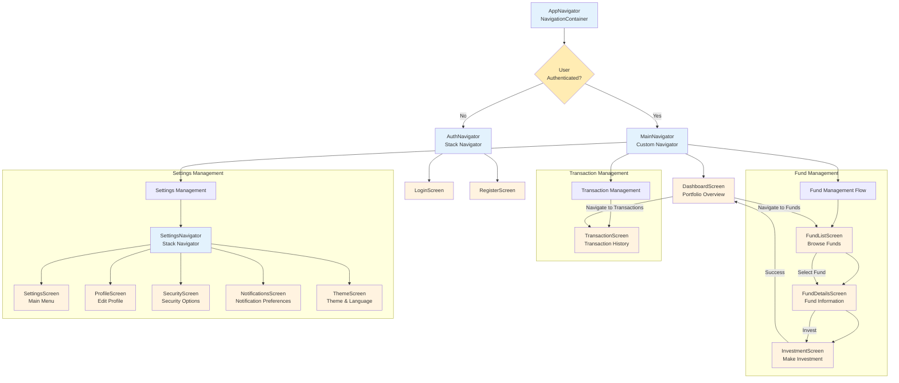
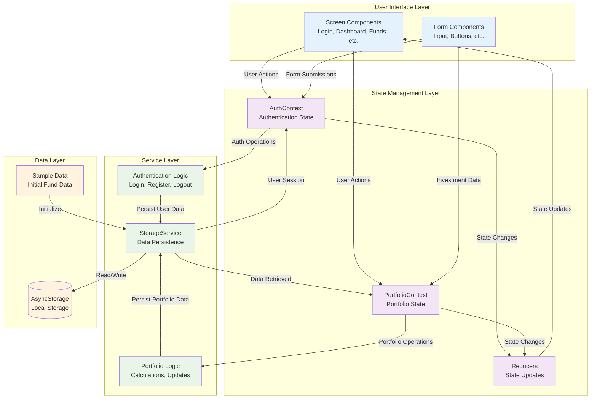
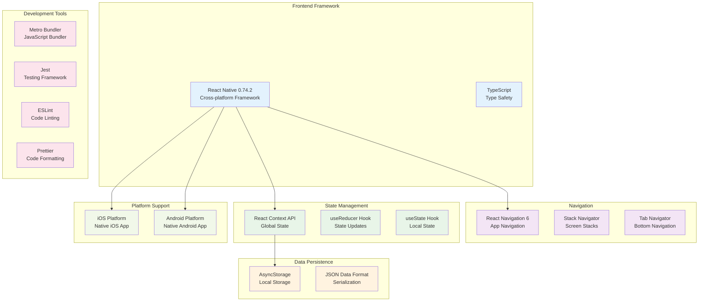

# React Native Investment Fund App - Architecture Overview

This document provides a comprehensive architecture overview of the React Native Investment Fund App using Mermaid diagrams to visualize the structure, data flow, and component relationships.

## Overall Application Architecture

## State Management Architecture

## Navigation Flow Architecture

## Data Flow Architecture

## Component Structure by Feature

```mermaid
graph TB
    %% Authentication Feature
    subgraph "Authentication Feature"
        AuthNav[AuthNavigator] --> LoginScreen[LoginScreen<br/>Email/Password Form]
        AuthNav --> RegisterScreen[RegisterScreen<br/>Registration Form]
        AuthContext --> |Manages| UserState[User State<br/>isAuthenticated, user, loading]
    end
    
    %% Dashboard Feature
    subgraph "Dashboard Feature"
        DashboardScreen[DashboardScreen<br/>Portfolio Overview] --> PortfolioCard[Portfolio Card<br/>Total Value, Gains/Losses]
        DashboardScreen --> ActionButtons[Action Buttons<br/>Navigate to Funds/Transactions]
        DashboardScreen --> RecentActivity[Recent Activity<br/>Transaction History]
    end
    
    %% Fund Management Feature
    subgraph "Fund Management Feature"
        FundListScreen[FundListScreen<br/>Fund Browser] --> SearchFilter[Search & Filter<br/>Category, Text Search]
        FundListScreen --> FundCard[FundCard Component<br/>Fund Details Display]
        FundDetailsScreen[FundDetailsScreen<br/>Fund Information] --> FundInfo[Fund Information<br/>Performance, Risk, Details]
        FundDetailsScreen --> InvestButton[Invest Button<br/>Navigate to Investment]
        InvestmentScreen[InvestmentScreen<br/>Investment Form] --> InvestmentForm[Investment Form<br/>Amount, Payment Method]
    end
    
    %% Transaction Feature
    subgraph "Transaction Feature"
        TransactionScreen[TransactionScreen<br/>Transaction History] --> TransactionList[Transaction List<br/>Purchase/Redemption History]
        TransactionScreen --> FilterOptions[Filter Options<br/>Date, Type, Status]
    end
    
    %% Settings Feature
    subgraph "Settings Feature ✅ Complete"
        SettingsNav[SettingsNavigator] --> SettingsScreen[SettingsScreen<br/>Main Settings Menu]
        SettingsNav --> ProfileScreen[ProfileScreen<br/>Edit Profile Information]
        SettingsNav --> SecurityScreen[SecurityScreen<br/>Password & Security]
        SettingsNav --> NotificationsScreen[NotificationsScreen<br/>Notification Preferences]
        SettingsNav --> ThemeScreen[ThemeScreen<br/>Theme & Language]
    end
    
    %% Common Components
    subgraph "Common Components"
        CustomButton[CustomButton<br/>Reusable Button]
        FundCard --> CustomButton
        InvestmentForm --> CustomButton
        LoadingSpinner[LoadingSpinner<br/>Loading States]
        ErrorBoundary[ErrorBoundary<br/>Error Handling]
    end
    
    %% Styling
    classDef complete fill:#c8e6c9
    classDef partial fill:#fff3e0
    classDef component fill:#e3f2fd
    
    class SettingsNav,SettingsScreen,ProfileScreen,SecurityScreen,NotificationsScreen,ThemeScreen complete
    class DashboardScreen,FundListScreen,FundDetailsScreen,InvestmentScreen,TransactionScreen partial
    class CustomButton,FundCard,LoadingSpinner,ErrorBoundary component
```

## Technology Stack

## Key Architecture Decisions

### 1. **State Management Pattern**
- **Context API**: Chosen over Redux for simplicity and React's built-in capabilities
- **useReducer**: Used for complex state logic in AuthContext and PortfolioContext
- **Local State**: Component-level state with useState for UI-specific state

### 2. **Navigation Architecture**
- **Conditional Navigation**: AppNavigator switches between AuthNavigator and MainNavigator based on authentication state
- **Custom Navigator**: MainNavigator uses custom navigation logic instead of tab/stack navigators for flexible screen management
- **Nested Navigation**: SettingsNavigator provides a stack-based sub-navigation for settings screens

### 3. **Data Layer Design**
- **StorageService**: Centralized data access layer wrapping AsyncStorage
- **Type Safety**: Full TypeScript interfaces for all data models
- **Caching**: Portfolio summary caching with expiration for performance
- **Session Management**: User session validation with 30-day expiry

### 4. **Feature Organization**
- **Screen-based Structure**: Organized by feature areas (auth, dashboard, funds, transactions, settings)
- **Common Components**: Reusable UI components in separate directory
- **Service Layer**: Business logic separated from UI components

### 5. **Implementation Status**
- ✅ **Complete**: Settings feature fully implemented with all screens and functionality
- ⚠️ **Partial**: Authentication (UI complete, logic needs enhancement)
- ⚠️ **Partial**: Dashboard (basic structure, needs portfolio calculations)
- ⚠️ **Partial**: Funds (UI framework, needs investment flow completion)
- ⚠️ **Basic**: Transactions (screen exists, needs full implementation)

## Development Guidelines

### Adding New Features
1. **Define Types**: Add interfaces to `src/types/index.ts`
2. **Create Context**: If global state needed, add to context providers
3. **Implement Screens**: Follow existing screen patterns
4. **Add Navigation**: Update appropriate navigator
5. **Add Storage**: Extend StorageService if persistence needed
6. **Write Tests**: Add tests following existing patterns

### Code Quality Standards
- **TypeScript**: Strict typing required for all components
- **Component Structure**: Functional components with hooks
- **Error Handling**: Proper error boundaries and try-catch blocks
- **Performance**: Lazy loading and memoization where appropriate
- **Testing**: Unit tests for critical business logic

This architecture supports a scalable, maintainable React Native application with clear separation of concerns and consistent patterns across all features.